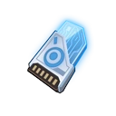
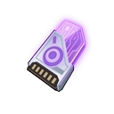
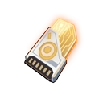
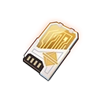

## Password Chests

### Updates

****Version 2.4****

In the new area of Innars, you won't see password chest as you normally do underwater.

They are inside the bellies of the fishes named Bulb Fish. Kill them and they will drop the chest in the form of a bubble wrapped Blue nucleus and Purple nucleus.
These fishes are aggressive so it is easy to aggro and group them together to slaughter these "mobile chests".

### Type Chip/Keys

In ToF, players can get Password Chips to open Password chests on the World Map.

{: width="32" } **Blue Chips** are for blue chests.

{: width="32" } **Purple Chips** are for purple chest.

{: width="32" } **Orange Chips** are for World Boss chests in Aesperia and Artificial island Region.

{: width="32" } **Yellow Keys** are for world Boss chest in Vera Region.

### Chest Mechanics

1. You can force open any Password chests and World Boss chests. However, you won't get the Rare rewards from it.
2. It is best to save Password Chips for opening Vera chests as Mira, a currency use in Vera will be rewarded. You get NONE in other regions. Mira is used for the Gachapon machines which will be covered in a separate guide.
3. You'll get to use multiple denominations of chips to open more times per chest.
4. Each Password chest opened will also give you activity points that count towards to your Weekly Activity Bar to get more Chips, Dark crystals and other goodies. these Activity points are also count towards the event missions that require Activity Points.
5. Blue and Purple Chests can drop Gold Gear and very rarely drop a SSR Pro Weapon box for a chance to score a SSR Standard Weapon when open with Chips.
6. World Boss Chests can drop SSR Standard weapon at random and listed SSR Matrice. but only with Chips opening them.

- TangSan#5765
